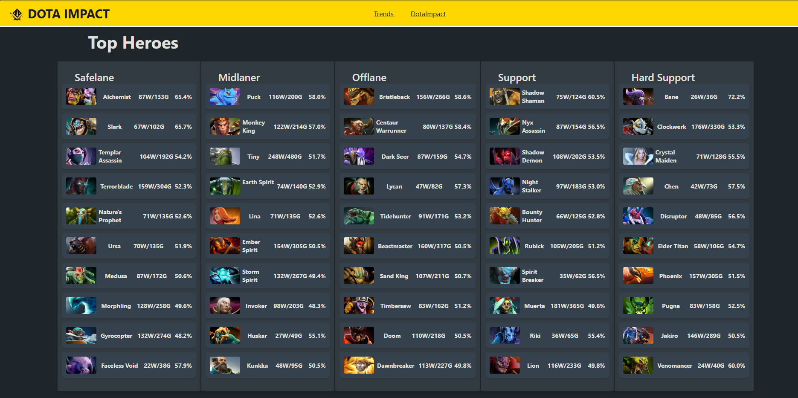
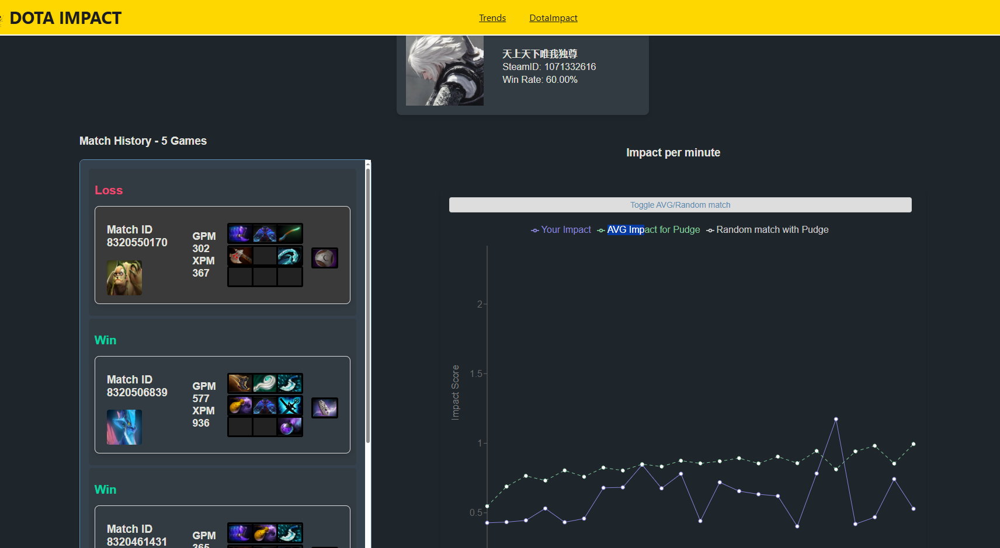

Snapshot of what the website looked like. 

DotaImpact - A dota 2 statistics website (React, Typescript, Express, PostgresDB)

This was an old website i made to analyze high level matches in a game i was interested in. It also had a tool to allow you to paste in your game profile and compare yourself to the averages of high level players.

https://escorenews.com/en/dota-2/article/67189-what-happened-to-dota2protracker-and-pro-player-builds-how-to-see-immortal-rank-replays-and-builds-in-dota-2
Unfortunately due to the developer changing the way the replay system worked for high level matches, data became unavailable, so many sites and mine no longer work. 

The actual analytics were a bit underwhelming. Analyzing a game like dota 2 is difficult because a lot of little important things can be hard to quantify in data. However this website was nice as an overview of what the current game looked like.
Most of my friends really enjoyed comparing themselves using the profile comparison tool. 

Still i really enjoyed developing this full stack website and I learned a lot about working developing a front-end, express servers and working with a database.
